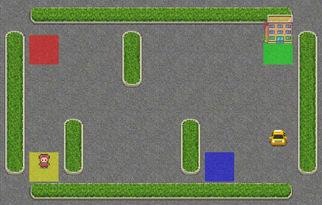

# 🚖 Q-Learning Taxi Agent

A reinforcement learning implementation using Q-learning to solve the classic Taxi-v3 environment from OpenAI Gymnasium. The agent learns to navigate a 5x5 grid world, pick up passengers, and drop them off at designated locations while maximizing cumulative rewards.

## 🎯 Project Overview

This project demonstrates the application of Q-learning, a model-free temporal difference learning algorithm, to train an autonomous taxi agent. The agent learns optimal policies through exploration and exploitation, updating Q-values based on the Bellman equation.

### 🎬 Agent Performance

Watch the trained agent in action after 9,750 training episodes:



_The agent successfully navigates the grid, picks up passengers (yellow), and drops them at their destinations (purple squares)._

## 🌟 Features

- **Q-Learning Implementation**: Complete Q-learning algorithm with epsilon-greedy policy
- **Video Recording**: Automatic recording of agent performance during training
- **Statistics Tracking**: Episode rewards and statistics monitoring
- **Configurable Hyperparameters**: Easy-to-adjust learning parameters
- **Comprehensive Logging**: Detailed training progress with Loguru
- **Modular Design**: Clean, well-documented code structure

## 🏗️ Environment Details

The Taxi environment is a classic reinforcement learning problem with:

- **State Space**: 500 discrete states (taxi position, passenger location, destination)
- **Action Space**: 6 discrete actions (North, South, East, West, Pickup, Dropoff)
- **Rewards**:
  - +20 for successful passenger dropoff
  - -10 for illegal pickup/dropoff attempts
  - -1 for each time step (encourages efficiency)

## 🚀 Quick Start

### Prerequisites

- Python 3.11+
- [UV](https://docs.astral.sh/uv/getting-started/installation/):

### Installation

1. Clone the repository:

```bash
git clone https://github.com/vnniciusg/rl-drive-taxi.git
cd rl-drive-taxi
```

2. Install dependencies:

```bash
uv sync
```

3. Run the training:

```bash
uv run train.py
```

## 📊 Usage

### Basic Training

```python
from train import run, QlearningConfig

# Train with default parameters
run(n_episodes=10000)
```

### Custom Configuration

```python
from train import run, QlearningConfig, _q_learning_config

# Modify hyperparameters
_q_learning_config.alpha = 0.2      # Increase learning rate
_q_learning_config.epsilon = 0.1    # Reduce exploration
_q_learning_config.gamma = 0.9      # Increase future reward importance

# Run training
run(n_episodes=50000)
```

### Environment Setup

```python
from train import setup_env

# Setup with custom parameters
env = setup_env(
    env_name="Taxi-v3",
    render_mode="human",        # Display training visually
    training_period=500         # Record video every 500 episodes
)
```

## 🔧 Configuration

The `QlearningConfig` class allows you to customize the learning algorithm:

| Parameter | Default | Description            |
| --------- | ------- | ---------------------- |
| `alpha`   | 0.1     | Learning rate (0-1)    |
| `gamma`   | 0.7     | Discount factor (0-1)  |
| `epsilon` | 0.2     | Exploration rate (0-1) |

## 📁 Project Structure

```
rl-drive-taxi/
├── train.py              # Main training script
├── main.py               # Alternative implementation
├── README.md             # Project documentation
├── LICENSE               # License file
├── pyproject.toml        # Project configuration
├── uv.lock              # Dependency lock file
└── taxi-agent/          # Generated videos and outputs
    ├── eval-episode-0.mp4
    ├── eval-episode-250.mp4
    └── ...
```

## 🎯 How Q-Learning Works

The Q-learning algorithm updates Q-values using the Bellman equation:

```
Q(s,a) ← Q(s,a) + α[r + γ max Q(s',a') - Q(s,a)]
```

Where:

- `s`: current state
- `a`: action taken
- `r`: reward received
- `s'`: next state
- `α`: learning rate
- `γ`: discount factor

The agent follows an epsilon-greedy policy, balancing exploration (random actions) with exploitation (best known actions).

## 📈 Training Progress

The agent learns progressively:

1. **Early Episodes (0-1000)**: Random exploration, poor performance
2. **Learning Phase (1000-5000)**: Q-values stabilize, performance improves
3. **Optimization (5000+)**: Fine-tuning policy, achieving optimal behavior

Videos are automatically saved in the `taxi-agent/` directory every 250 episodes, allowing you to visualize the learning progress.

## 🔗 References and Learning Resources

- [Gymnasium Basic Usage Guide](https://gymnasium.farama.org/introduction/basic_usage/)
- [Taxi Environment Documentation](https://gymnasium.farama.org/environments/toy_text/taxi/)
- [Recording Agent Performance](https://gymnasium.farama.org/introduction/record_agent/)
- [Q-Learning Algorithm](https://en.wikipedia.org/wiki/Q-learning)
- [Reinforcement Learning: An Introduction (Sutton & Barto)](http://incompleteideas.net/book/the-book-2nd.html)

## 📝 License

This project is licensed under the terms specified in the [LICENSE](LICENSE) file.
